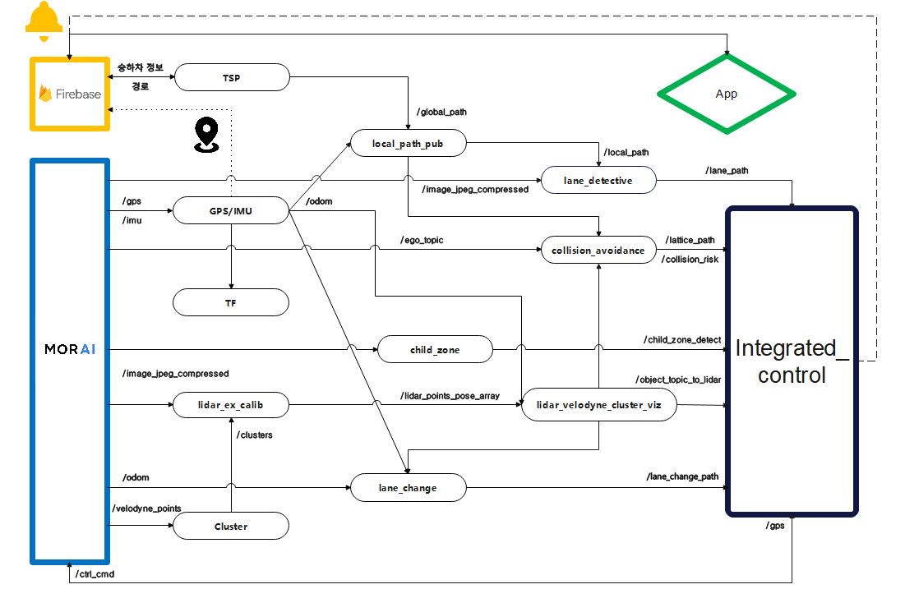
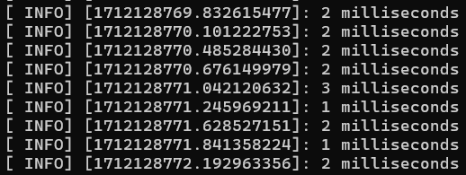
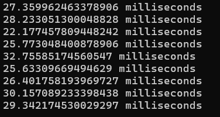
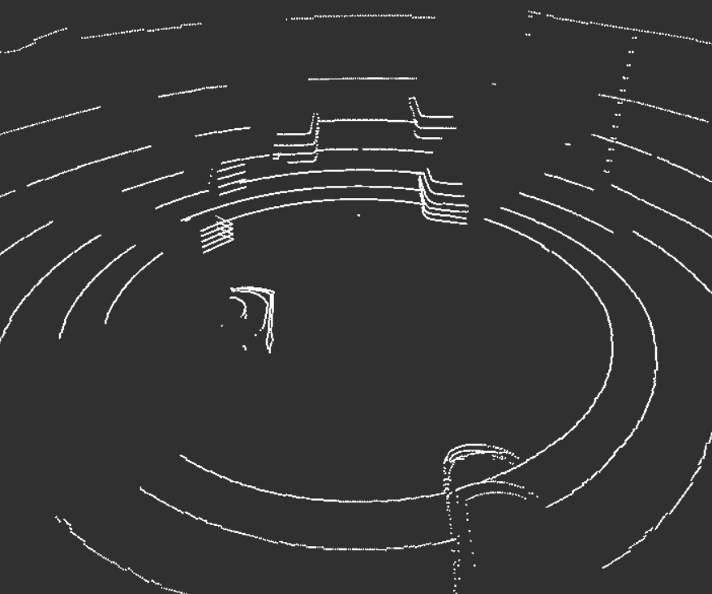
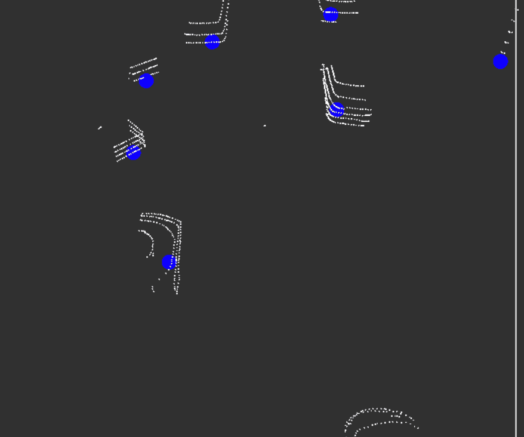
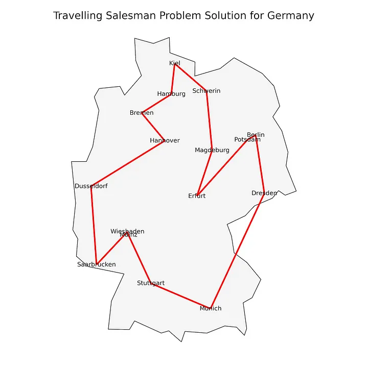

## 어린이 학원 버스 자율주행 프로젝트 🚌

# 아이 파인 🐣

#### 🚘 내 기쁨은 너가 벤틀리로 자율주행 🚘
## 프로젝트 이름
- [협업 노션](https://www.notion.so/1be1fedb24e347d9a74cf981affcc826)
- [깃랩](https://lab.ssafy.com/s10-mobility-autodriving-sub1/S10P21A409)    

## 🚍 **Team**

<table>
 <tr>
    <td align="center"><a href="https://github.com/"></td>
    <td align="center"><a href="https://github.com/"></td>
    <td align="center"><a href="https://github.com/"></td>
    <td align="center"><a href="https://github.com/"></td>
    <td align="center"><a href="https://github.com/"></td>
    <td align="center"><a href="https://github.com/"></td>
  </tr>
  <tr>
    <td align="center">팀장</td>
    <td align="center">팀원</td>
    <td align="center">팀원</td>
    <td align="center">팀원</td>
    <td align="center">팀원</td>
    <td align="center">팀원</td>
  </tr>
     <tr>
    <td align="center"><a href="https://github.com/"><sub><b>한진우</b></td>
    <td align="center"><a href="https://github.com/"><sub><b>김호준</b></td>
    <td align="center"><a href="https://github.com/ghlee96"><sub><b>이규형</b></td>
    <td align="center"><a href="https://github.com/"><sub><b>이수지</b></td>
    <td align="center"><a href="https://github.com/"><sub><b>임병은</b></td>
    <td align="center"><a href="https://github.com/"><sub><b>노현경</b></td>
  </tr>

</table>

- 한진우 : Camera 차선인지      
- 김호준 : Camera 객체인지, Lidar-Camera Sensor Fusion     
- 이규형 : LiDAR 객체인지, 경로 생성
- 이수지 : 차선 변경
- 임병은 : 충돌 회피
- 노현경 : 애플리케이션, 서기, 발표, ucc

<br><br>

## 🛠 Stack


<br><br>

### 🚍 프로젝트 개요

**자율 주행 기술을 활용해 학원 버스의 안전성 및 편리성 증대**

최근 들어 증가하는 학원 버스 사고에 대한 우려를 해소하고, 어린이들의 통학 안전성과 효율성을 향상하기 위해 자율주행 기술을 통합한 프로젝트입니다.

아이 파인은 어린이 학원 자율주행 버스로, 사고 위험을 줄이고 실시간 위치를 앱을 통해 확인하여 보호자에게 안심을 제공하는 것을 목표로 합니다.

### 🚍 프로젝트 소개

**Morai 시뮬레이터를 기반으로 하는 어린이 학원 버스가 주어진 경로에 따라 자율주행**

- 탑승 학생에 따른 경로 최적화
- 돌발 장애물 및 고정 장애물 인식 및 회피 주행
- 어린이 보호구역 같은 특정 위치 운행 속도 제한되는 안전 주행 모드
- 어린이 학원 버스의 실시간 위치를 앱으로 확인 가능

## &#128215; 아키텍처



## &#128217; 포팅메뉴얼
    
https://www.notion.so/23e6552d01e3439f93b06c18ba835ed0


### 🚍 프로젝트 설명

1. 인지    
  - 카메라 객체인지       
    - HSV를 활용한 객체 탐지 방식을 사용하여 차량은 분홍색 장애물은 노란색 사람은 보라색으로 분류하여 객체를 탐지
    
  - LiDAR-Camera Fusion
    - 속도를 위해 연산량이 가장 작은 Early Fusion을 사용하여 진행    
    - 라이다의 3차원 데이터와 프로젝션된 2차원 카메라 데이터를 사용하여 calibration 진행
    - 카메라로 탐지된 객체에 포함되어있는 라이다 poincloud에 좌표값을 반환하여 publish 
    

  - 카메라 차선인지
    - HSV화 => Region of Interest => Bird's eye view => Binarization 과정을 거쳐 차선 정보 이미지 처리
    - 처리 된 이미지를 RANSAC 알고리즘을 통해 차선 정보 인식
    - 추출한 차선 정보와 vehicle 정보를 이용하여 차의 차선정보 출력
    
  - 어린이보호구역 카메라 감지
    - 카메라를 통해 들어온 이미지를 이용하여 어린이보호구역 감지
    - 어린이보호구역에 들어온다면 차의 속도 제한(30km)     
      


 - LiDAR
   - LiDAR의 Point cloud 데이터를 활용해 장애물을 인식하고 위치를 전달한다.
   - 실시간 센서 데이터 처리 위해 python에서 c++ 전환
     - 약 1000% 연산 속도 향상
     <p align="center">
       
        
     </p>
   - 결과
     - Voxel Grid Downsampling (다운샘플링), roi (관심 영역 설정), ransac (바닥 제거), Euclidean clustering (군집화)를 통해 장애물 좌표 publish
      <p align="center">
        
        
      </p>

2. 판단/제어

  - 경로 생성
        

    - Firebase의 승하차정보 기반으로 승하차 아이가 있는 노드 결정
    - TSP, A* 알고리즘을 사용해 학원에서 출발하여 아이들을 승하차 하고, 다시 학원으로 돌아오는 최단 경로 생성
      - TSP 알고리즘 : 최적 노드 순회 순서 결정
      - A* 알고리즘 : 두 노드간의 최단 경로 생성
    - 생성된 경로 Firebase 및 ROS에 publish
    - 경로 총 길이 Firebase에 저장

  - 승하차 여부 알림
    - Firebase를 사용해 해당 위치의 승하차 고객에게 푸시 알림 및 알림
    - 학원에서 출발, 도착 시 승하차를 선택한 고객에게 모두 푸시 알림 및 알림

  - 주행
    - integrated_control.py 에서 통합 제어 진행. 곡률 기반 속도 계획, Adative_cruise_control, pid 제어, pure_pursuit, 보행자 정지, 어린이 보호구역 속도 제한 등 차량의 통합 제어
    

  - 충돌 회피
    - 회피 경로 생성 - 정적 장애물(obstacle) 대상
      - 기존 지역경로에 장애물과 충돌 위험이 있는지 판단 
      - Lattice 를 이용해 3차곡선 계획법을 통해 회피 경로 6개 생성
    - 회피 경로 선택
      - 생성된 경로들 중 충돌여부, 조향각 변화량 등을 고려하여 가중치를 부여하고 가장 weight 가 적은 경로 선택
      
    - 보행자 충돌 위험시 정지
      - 현재 주행 경로 상 보행자 충돌 위험을 유클리드 거리 계산을 통해 판단하고 Bool 값을 주행 코드에 전달하여 주행 일시 정지
      
      

  - 차선 변경
    - 차량 주행 경로상 장애물의 유무 파악
    - 장애물이 있다면 주행 경로를 변경
    - 차선 변경 경로를 직선 또는 3차 곡선 형태로 생성
      - 변환·역변환 행렬, 3차 곡선 방정식, 좌표 변환, 경로 연장
    - 차선 변경을 완료하면 다시 경로상 장애물의 유무 파악     
  

3. 애플리케이션

  #### 1. 회원 관리
  ##### 1. 회원가입
  - 모바일으로 접속 시 보이는 회원가입 화면
  - Firebase Authentication 이용
  - 회원정보 미기입 시 alert 생성
  - 아이디 중복 체크, 비밀번호 일치여부 확인

  ##### 2. 로그인
  - 모바일 접속 시 보이는 로그인 화면
  - Firebase에 등록된 회원 기준으로 아이디, 비밀번호 일치여부 확인
  - 정보 미기입시 alert 생성
  - 회원 UID를 AsyncStorage를 이용해 저장하여 애플리케이션을 종료해도 정보가 남아있음

  ##### 3. 로그아웃
  - Mypage 로그아웃 버튼 클릭 시 로그아웃
  - AsyncStorage에 저장된 회원 UID 제거


  #### 2. 차량 실시간 통신
  ##### 1. 차량 위치 확인
  - MainPage에 Google maps api로 지도 구현
  - initial region은 firestore에 저장된 버스 위치
  - Firestore에 저장되는 실시간 차량의 GPS정보를 수신받아 Map Marker로 표시
  - 지도를 이동하면 해당 위치에 고정, 하단의 버스 위치로 이동 버튼으로 현재 차량의 위치 중심으로 이동

  ##### 2. 차량 이동 경로 확인
  - Firestore에 저장된 global path의 latitude, longitude 기반으로 지도에 점을 찍어 그 사이를 잇는 polyline 사용
  - 정류장 방문 순서를 빨간 동그라미에 번호로 기재
  - 주행경로가 변경되면 실시간으로 애플리케이션 지도에 표기

  ##### 3. 푸쉬 알림
  - 지정한 승하차위치에 차량이 도착하면 FCM을 이용한 애플리케이션 푸쉬 알림 생성
  - 최초 로그인 시 알림 권한 요청 및 사용자의 FCM토큰 firestore 저장
  - 애플리케이션이 Background나 Quit 상태에도 푸쉬알림 수신
  - 지정한 승하차 위치에 도착하면 승하차 위치 + 도착했습니다 알림, 학원에 도착하면 학원에 도착했습니다 알림 수신

  ##### 4. 애플리케이션 내 알림목록
  - 지정한 승하차 위치 및 학원에 차량이 도착하면 실시간으로 firestore의 변화를 인지해 알림 목록에 추가
  - 승하차 위치와 시간(YYYY:MM:DD HH:MM:SS 형태) 표시

  ##### 5. 예상도착시간
  - Firebase를 통해 총 주행거리를 수신받아 시속 40km로 주행했을 때의 시간을 Mypage에 표기

  ##### 6. 최근승하차 시각
  - 알림이 갱신될 때 Mypage의 최근 승하차 시간 update

  ##### 7. 승하차 위치 선택
  - initial region을 현재 사용자의 위치로 설정하여 사용자가 가장 가까운 탑승지를 확인할 수 있음
  - 최초 로그인 시 위치정보 수집 권한 요청
  - 선택창은 기존에 사용자가 설정한 승하차위치의 이름으로 설정
  - 선택창을 클릭하면 승하차 위치 변경 가능
  - Modal을 이전, 다음 버튼을 통해 승하차 위치들이 확인 가능하며, Modal이 이동될 때 Marker가 중심에 오도록 설정
  -사용자가 변경하기 버튼을 누르면 firestore에 저장


## 💡 브랜치 전략

Github flow + 담당repo + dev

- master : 무결성 유지, dev 브랜치에서만 PR 가능
- dev : 개발용, 기능 브랜치들 merge용, 버그 해결용
- 기능 : 새로운 기능 개발용 (브랜치명을 명시적으로 작성)

```
master
 └─ dev
     ├── 인지
     |     ├── 브랜치 1
     |     └── 브랜치 2
     ├── 판단/제어
     |     ├── 브랜치 1
     |     └── 브랜치 2
     └── application
```

<br><br>

## 🤙🏻 commit 컨벤션

```
💡 feat : 새로운 기능 추가
🐞 fix : 버그 수정
📄 docs : 문서 수정
🛠 refact : 코드 리팩토링
💅 style : 코드 의미에 영향을 주지 않는 변경사항
📦 chore : 빌드 부분 혹은 패키지 매니저 수정사항
🗑️ del : 삭제
```
