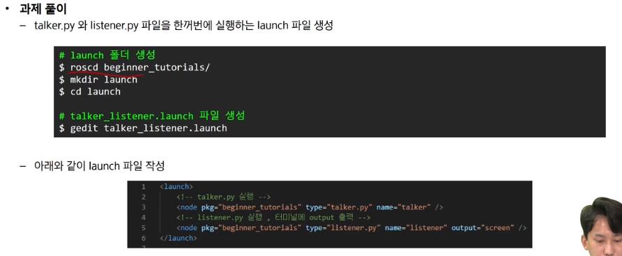

# 사전 학습

## 3강

- 3강 ROS
    - 리눅스 Morai 실행 권한
    
    ```bash
    chmod +x [MORAISim.sh](http://moraisim.sh/)
    ```
    
    - 다운로드
    
    ```bash
    wget [https://raw.github.com/ros/ros_tutorials/melodic-devel/rospy_tutorials/001_talker_listener/talker.py](https://raw.github.com/ros/ros_tutorials/melodic-devel/rospy_tutorials/001_talker_listener/talker.py)
    
    wget https://raw.github.com/ros/ros_tutorials/melodic-devel/rospy_tutorials/001_talker_listener/listener.py
    ```
    
    - `roscd: No such package/stack 'beginner_tutorials/scripts'`
        
        새로 여는 터미널 마다 환경 설정 해야함
        
    
    ```bash
    source /opt/ros/melodic/setup.bash
    source ~/catkin_ws/devel/setup.bash
    ```
    
    - launch 코드(과제)
    
    ```bash
    <launch>
      <node pkg="beginner_tutorials" type="talker.py" name="talker" output="screen"/>
    
      <node pkg="beginner_tutorials" type="listener.py" name="listener" output="screen"/>
    </launch>
    ```
    
    - 과제 풀이
        
        
        
    - 실행 결과
    
    
    

## 4강, 5강

- 4강
    - 새로 여는 터미널 마다 환경 설정하면 되더라(세팅 바뀔 때???)
    
    ```bash
    source /opt/ros/melodic/setup.bash
    source ~/catkin_ws/devel/setup.bash
    ```
    
    - 자동 세팅하는 법
    
    ```bash
    1. vi ~/.bashrc
    2.  source /opt/ros/melodic/setup.bash
        source ~/catkin_ws/devel/setup.bash
        다음 내용 추가(bashrc파일 가장 밑에 추가(아마 첫줄은 추가되어있을 거임)
    3. 저장
    4. 터미널 새로 열 때 source ~/.bashrc
    ```
    
    - 터미널에서 Bridge 연결
        
        
        
    
    ```bash
    roslaunch rosbridge_server rosbridge_websocket.launch
    ```
    
    - connect 완료되면
    
    ```jsx
    rostopic list
    ```
    
    
    
    - topic publish 예시
        
        ```jsx
        rostopic pub /ctrl_cmd morai_msgs/CtrlCmd "{longlCmdType: 1, accel: 0.6, brake: 0.0, steering: 0.1, velocity: 0.0, acceleration: 0.0}"
        ```
        
    
    - s_drive.py
        
        ```jsx
        #!/usr/bin/env python
        
        import rospy
        from morai_msgs.msg import CtrlCmd
        
        class s_drive():
            def __init__(self):
                rospy.init_node('s_drive', anonymous=True)
                cmd_pub = rospy.Publisher('/ctrl_cmd', CtrlCmd, queue_size=1)
                rate = rospy.Rate(30)
                cmd = CtrlCmd()
                cmd.longlCmdType = 2
                cmd.velocity = 10
                steering_cmd = [ -0.2, 0.2]
                cmd_cnts = 50
        
                while not rospy.is_shutdown():
                    for i in range(2):
                        cmd.steering = steering_cmd[i]
                        rospy.loginfo(cmd)
                        for _ in range(cmd_cnts):
                            cmd_pub.publish(cmd)
                            rate.sleep()
        
        if __name__ == '__main__':
            try:
                s_d = s_drive()
            except rospy.ROSInterruptException:
                pass
        ```
        
    
    - 충돌 회피 코드(과제)
        
        ```jsx
        #!/usr/bin/env python
        # -*- coding: utf-8 -*-
        import rospy
        from morai_msgs.msg import CtrlCmd, CollisionData, EgoVehicleStatus, EventInfo
        from morai_msgs.srv import MoraiEventCmdSrv
        from enum import Enum
        
        class Gear(Enum):
            P = 1
            R = 2
            N = 3
            D = 4
        
        class s_drive():
            def __init__(self):
                rospy.init_node('collision_avoid', anonymous=True)
                
                # publisher
                self.cmd_pub = rospy.Publisher('/ctrl_cmd', CtrlCmd, queue_size=1)
                
                # subscriber
                rospy.Subscriber('/CollisionData', CollisionData, self.collision_callback)
                rospy.Subscriber('/Ego_topic', EgoVehicleStatus, self.ego_callback)
        
                # service
                rospy.wait_for_service('/Service_MoraiEventCmd')
                self.event_cmd_srv = rospy.ServiceProxy('Service_MoraiEventCmd', MoraiEventCmdSrv)
        
                self.rate = rospy.Rate(10)
        
                self.is_collision = False
                self.ego_status = EgoVehicleStatus()
        
                # 처음에 auto_mode , drive gear로 세팅
                self.send_gear_cmd(Gear.D.value)
        
                while not rospy.is_shutdown():
                    if self.is_collision:
                        # 후진
                        self.send_gear_cmd(Gear.R.value)
                        self.send_ctrl_cmd(0, 10.0) 
                        rospy.sleep(4)
                        
                        # 방향 꺾기		
                        self.send_ctrl_cmd(1.0, 10.0)  
                        rospy.sleep(1) 
                        
                        # 전진
                        self.send_gear_cmd(Gear.D.value)
                        self.send_ctrl_cmd(0, 10.0) 
                        rospy.sleep(4.2)
        
                        # 방향 원래대로
                        self.send_ctrl_cmd(0.9, 10.0)
                        rospy.sleep(1)
        
                    else:
                        # 충돌이 감지되지 않으면 차량 전진
                        self.send_ctrl_cmd(0, 20.0)
                        self.rate.sleep()
        
            # 충돌 메시지 콜백 함수
            def collision_callback(self, data):
                if(len(data.collision_object) > 0):
                    self.is_collision = True
                else:
                    self.is_collision = False
        
            # EGO 차량 상태 정보 콜백 함수
            def ego_callback(self, data):
                #print(self.ego_status.velocity.x)
                self.ego_status = data
        
            # 기어 변경 이벤트 메시지 세팅 함수
            def send_gear_cmd(self, gear_mode):
                # 기어 변경이 제대로 되기 위해서는 차량 속도가 약 0 이어야함
                while( abs(self.ego_status.velocity.x) > 0.1):
                    self.send_ctrl_cmd(0,0)
                    self.rate.sleep()
                
                gear_cmd = EventInfo()
                gear_cmd.option = 3
                gear_cmd.ctrl_mode = 3
                gear_cmd.gear = gear_mode
                gear_cmd_resp = self.event_cmd_srv(gear_cmd)
                rospy.loginfo(gear_cmd)
        
            # ctrl_cmd 메시지 세팅 함수
            def send_ctrl_cmd(self, steering ,velocity):
                cmd = CtrlCmd()
                if(velocity > 0):
                    cmd.longlCmdType = 2
                    cmd.velocity = velocity
                    cmd.steering = steering
                else:
                    cmd.longlCmdType = 1
                    cmd.brake = 1
                    cmd.steering = 0
                self.cmd_pub.publish(cmd)
        
        if __name__ == '__main__':
            try:
                s_d = s_drive()
            except rospy.ROSInterruptException:
                pass
        
        ```
        
- 회피주행 테스트


## 6강, 7강, 8강

- 6강
    
    
    
    - 우리나라는 횡축 메르카토르 도법 사용


- 8강
    
    ```javascript
    <!DOCTYPE html>
    <html>
      <head>
        <meta charset="utf-8" />
        <!-- import roslijs scripts : for using ROS -->
        <script
          type="text/javascript"
          src="https://cdnjs.cloudflare.com/ajax/libs/roslibjs/1.1.0/roslib.min.js"
        ></script>
    ```
    
    <aside>
    💡 위처럼 script src 변경하면 연결 된다
    </aside>

    


### 개인 학습

- MORAI 자율주행 예시
https://github.com/MORAI-Autonomous/MORAI-DriveExample_ROS/tree/main


