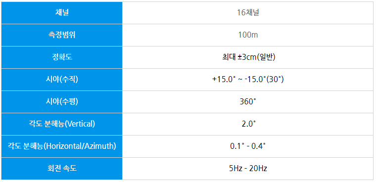

# [규형] 라이다 인지

- 라이다 세팅
    - VLP 16 드라이버 설치 ([https://wiki.ros.org/velodyne/Tutorials/Getting Started with the Velodyne VLP16](https://wiki.ros.org/velodyne/Tutorials/Getting%20Started%20with%20the%20Velodyne%20VLP16))
        
        ```bash
        # Ubuntu 20.04
        sudo apt-get install ros-noetic-velodyne
        cd ~/catkin_ws/src/ && git clone https://github.com/ros-drivers/velodyne.git
        cd ~/catkin_ws
        rosdep install --from-paths src --ignore-src --rosdistro noetic -y
        cd ~/catkin_ws/ && catkin_make
        ```
        
    
    - MORAI 연결
    
    
    
    3d LiDAR 선택
    
    UDP 연결 !!! (ROS 아님)
    
    IP는 각자 확인하고 수정
    
    - IP 재부팅 하면 바뀌니까 확인하고 넣기
    
    
    
    host IP : pc cmd에서 확인 (WSL)
    
    
    
    destination IP : 우분투 IP (inet)
    
    - rviz
    
    
    
    Fixed Frame : velodyne으로 변경(map 아님)
    
- pcl 설치
    
    [(Ubuntu 20.04) PCL, open3d 설치하기 👿](https://velog.io/@choonsik_mom/Ubuntu-20.04-PCL-open3d-설치하기)
    
    우분투에 압축 파일 넣고 아래 코드 실행
    
    [source.tar.gz](imgs/source.tar.gz)
    
    ```bash
    tar xvf source.tar.gz
    cd pcl && mkdir build && cd build
    cmake -DMAKE_BUILD_TYPE=Release ..
    make -j2
    make install
    
    sudo apt-get install python3-pcl pcl-tools
    pip3 install open3d
    ```
    

- ~~cmake~~
    
    ```bash
    wget https://github.com/Kitware/CMake/releases/download/v3.23.1/cmake-3.23.1.tar.gz
    tar -xvf cmake=3.23.1.tar.gz
    cd cmake=3.23.1
    ./bootstrap --prefix=/usr
    make
    sudo make install
    
    # 확인
    cmake --version
    ```
    

- VLP16 spec
    
    
    

### 코드 적용 결과

- roi

 전


후


- voxel + roi + RANSAC

전


후


### 추가로 작성할 것 : C++ 전환 설명

> 참고자료
> 

[자율주행을 위한 라이다(Lidar) 센서와 라이다 포인트 클라우드 처리 방법](https://gaussian37.github.io/autodrive-lidar-intro/)

[LiDAR Introduction](https://velog.io/@noogoolgga/LiDAR-Introduction)

[ROS 실습 (90%) · PCL Tutorial](https://adioshun.gitbooks.io/pcl-tutorial/content/part-1/part01-chapter05/part01-chapter05-practice.html)

- 보도블럭 z : -0.37
- 라이다 z : 1.51