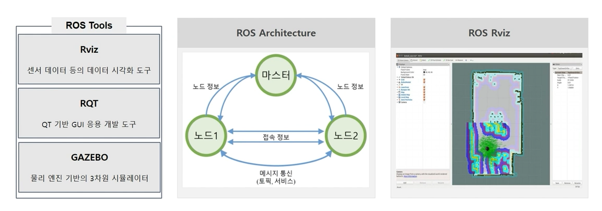
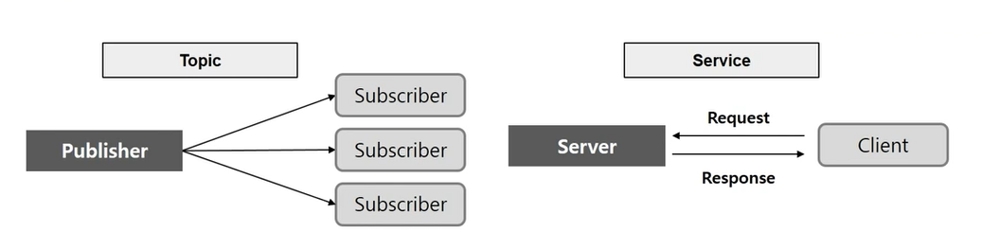

## 개요
- 로봇을 개발하는데 있어 필수적인 라이브러리 제공
- Applications 부분만 개발하면 되므로 개발시간, 비용 절약 
- ROS wiki 활용

## ROS(Robot operating system)
- 로봇 소프트웨어를 개발하기 위한 소프트웨어 프레임워크
- 노드간 통신을 기반으로 전체 시스템 구동
- 메시지 기록 재생 기능으로 반복적인 실험가능, 알고리즘 개발에 용이
- 

### ROS용어
- ROS Master
  - 노드와 노드 사이의 연결과 통신을 위한 서버
  - 마스터가 없으면 ROS 노드 간 Message, Topic 등의 통신 불가
  - 실행 명령어: rescore
- ROS Node
  - ROS에서 실행되는 최소 단위 프로세스(프로그램)
  - ROS에서는 하나의 목적에 하나의 노드를 개발 추천
- ROS Message
  - 노드와 노드 간의 데이터를 주고 받는 양식
  - ROS에서는 메시지를 통해 노드 간 데이터를 주고 받음
- ROS Package
  - ROS 소프트웨어의 기본 단위
  - 패키지는 노드, 라이브러리, 환경설정 파일 등을 통합하는 최소의 빌드단위이자 배포 단위
- ROS Topic
  - 단방향의 연속적인 메시지 송 수신 방식
  - 메시지를 송신하기 위해 토픽으로 마스터에 등록하여 메시지를 보냄
- ROS Service
  - 양 방향의 일회성 송 수신 방식
- ROS Publish
  - Topic에 원하는 메시지를 담아 송신하는 것
- ROS Publisher
  - Publish를 수행하기 위해 Topic을 포함한 자신의 정보를 마스터에 등록 -> Subscriber Node에 Message를 보냄
  - 하나의 노드에 여러 개의 Publisher를 선언 가능
- ROS Subscribe
  - Topic의 내용에 해당하는 Message를 수신하는 것
- ROS Subscriber
  - Subscribe를 수행하기 위해 Topic을 포함한 자신의 정보를 마스터에 등록 수신하고자 하는 Topic의 정보를 Master로부터 받음
  - 하나의 노드에 여러 개의 Subscribe를 선언 가능

### ROS 통신 기본 개념
   

| Topic | Service |
| ----- | ------|
| 단방향, 비동기 통신 | 양방향, 동기 통신 |
| Publisher : Message 송신 | Service Client : Service 요청 |
| Subscriber : Message 수신 | Service Server : Service 응답 |
| 지속적으로 발생하는 송 수신에 적합 | 클라이언트 요청 후 서버에서 응답 |
| 1:N, 1:1, N:1, N:N 모두 통신 가능 | 요청과 응답이 끊기면 노드 종료 |