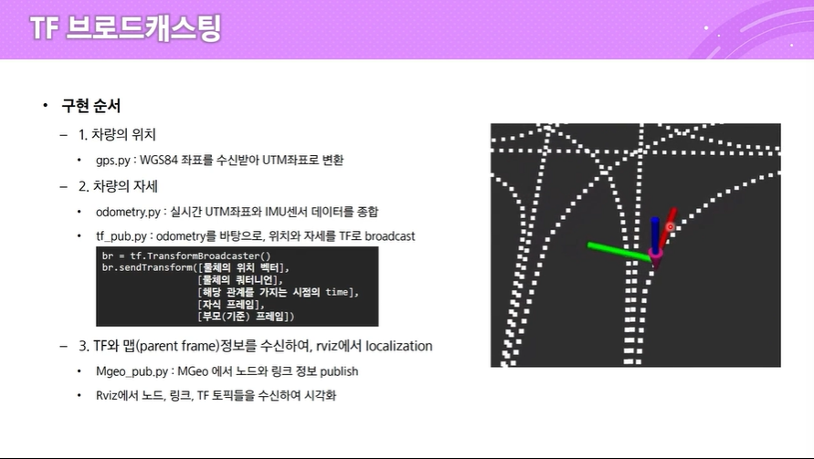

## TF 브로드 캐스팅
- Transform의 줄임말
- 물체의 상태를 표현할 때 사용
  - 위치(Position)
  - 자세(Pose)
  - 방향(Orientation)
- 물체의 상태를 좌표계를 달아 표현

### TF를 사용하는 이유
- 모든 ROS의 frame은 유클리드 좌표계로 구성
- 서로 독립된 상태이므로 frame간의 관계를 표현해야함
- 관계 추척하기 위해 TF정의

### TF 정의
- 물체의 위치벡터
- 물체의 쿼터니언
- 해당 관계를 가지는 시점의 time
- 자식프레임
- 부모(기준)프레임

### 구현방법

### Localization 구현
1. 차량의 위치
  - gps.py: 실시간 WSG84 좌표를 변환하여 UTM좌표 데이터 publish
  - 시뮬레이터 맵 기준 좌표가 필요하므로, 기존 utm좌표에서 offset적용
2. 차량의 자세
  - odometry.py: UTM좌표와 IMU센서 데이터를 종합
  - tf_pub.py: odom 데이터를 바탕으로, 맵 좌표계를 기반으로 한 TF를 broadcast