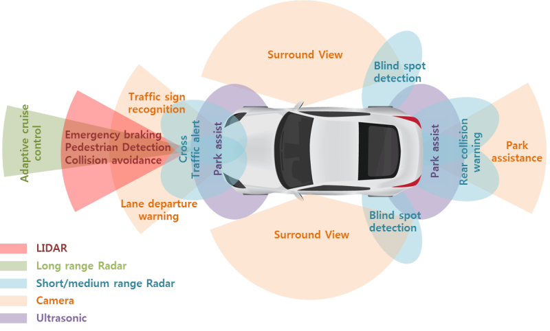

## 자율주행 센서
- 자율주행에서 센서는 사람의 눈과 같은 역할
- 센서의 종류
  - Camera
  - LiDAR
  - Radar
  - GPS
  - IMU

### Camera
- 카메라센서는 사진을 찍는 기기
- 시각적으로 보이는 정보
  - 딥러닝을 통한 차량 및 보행자를 포함한 객체 인지
  - 표지판의 제한속도 정보
  - 차선 인지
  - 신호등 인지
- 비교적 낮은 단가
- 카메라 단독으로는 정확한 거리 측정 힘듦
- 밤이나 악천후 등의 기상상태에 대해 품질 저하
#### Camera Sensor Setting GUI
1. Sensor Model Selsction
  - Pinhole Camera Model: 일반적인 모델
  - Fisheye Camera Model: 광각렌즈
2. Ground Truth Selection
  - 기상학에서 유래된 용어
  - 어느 한 장소에서 수집된 정보를 의미
  - 보통 지상 실측 정보로 해석
  - GT(Ground Truth Selection)는 학습하고자 하는 **데이터의 원본 혹은 실제 값**을 표현
  - 종류
    - RGB: 세상을 바라보는 형태로 표현
    - Semantic
      - 같은 객체끼리 구분을 해주는 기능
      - Seen(이미 학습된 자료)을 나타낼 때 사용
      - 객체들이 묶여있기 때문에 차량이 주행할 영역을 판단 가능
    - Instance
      - 객체를 식별(Identification)하는 기능
      - 각 객체에 바운딩 박스
      - 객체의 위치와 속도의 정보를 가지고 있음 
  - RGB기반으로 나온 정보가 아닌 시뮬레이터 내에서 참 값을 알고 있기 때문에 Semantic과 Instance정보를 뽑아냄
  - 이미지 처리 알고리즘 검증을 위한 것이라면 GT들과 비교하는 것이 하나의 방법
  - 이미지 처리 된 데이터로 차량 제어나 다른 알고리즘 적용을 위한거라면 정답값으로 주는 GT를 사용하는 것을 권장
3. Parameter Settings   
| Parameter       | Unit              |
| --------------- | ----------------- |
| Sensor Location| - Position & Orientation respected to vehicle |
| Parameter       | - Resolution(pixel)   - FoV(deg)   - Camera Intrinsic   &nbsp;&nbsp;&nbsp;&nbsp; - Focal Length   &nbsp;&nbsp;&nbsp;&nbsp; - Prinsipal Point   &nbsp;&nbsp;&nbsp;&nbsp; - Image Sensor Size |
| Communication Interface | - UDP / ROS protocol |

### LiDAR
- 레이저 펄스를 쏘아 반사되어 돌아오는 시간을 이용하여 거리 인지
- 작은 물체도 감지 할 수 있을 정도로 정밀도가 높음
- 형태 인식 기능: 3D 이미지 제공 가능
- 높은 에너지 소비와 가격대
- 큰 외형
- 눈이나 비에 반사되어 악천후에 취약

#### LiDAR Sensor Setting GUI
1. Sensor Model Selection
  - HDL 64
  - VLS 128
  - Velarray
  - ....
2. Ground Truth Selection
  - Intensity
    - 레이저 펄스가 물체에 반사되어 돌아오는 강도
    - 매질이나 물체의 표면의 거친 정도, 각도에 따라 다르게 표현
  - Semantic
  - Instance
3. Parameter Settings
  - Noise Model Parameters
    - 실제 라이다 센서의 값과 시뮬레이터의 값이 매우 다르므로 noise값을 조정하여 실제 값과 유사하게 만드는 과정 필요

### Radar
- 전파를 매개체로 사물간 거리와 형태 파악
- LiDAR보다 정밀도가 떨어짐
- 악천후에 강함
- 소형화 가능
- 사이즈 = 성능
- 작은 물체의 식별 어려움
- 정밀한 이미지 제공 불가

### 센서들의 범위
- 
- tan공식, FoV등을 이용하여 최소 감지거리 계산

### GPS
- 인공위성을 이용하여 현재위치를 알아내는 센서
- 31개의 인공위성으로 구성
- 최소 4개 이상의 위성과 연결되어 있어야 위치 계산 가능
- 경로계획에 사용하기 위해 좌표값을 2D로 받아야함
  - WGS84(3D) 좌표 -> UTM(2D) 좌표 변환 필요
- 숲이나 건물(터널)등의 장애물에 대한 영향이 큼