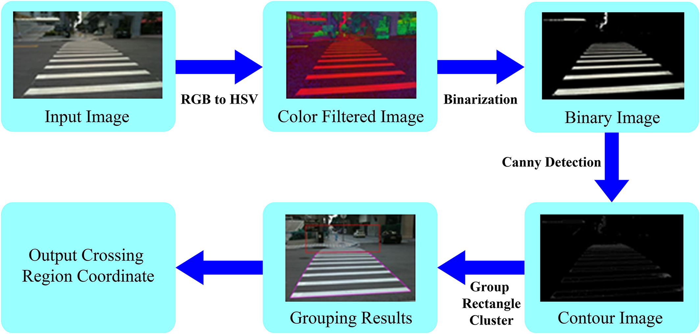

## 차선 인지(카메라 센서)
- 카메라 센서를 통한 차선 인지는 4가지 단계가 존재
  1. 이진화
  2. Region of interest
  3. Bird's eye view
  4. Curve fitting
- 앞의 3가지 단계는 구현하는 개발자(또는 회사)에 따라 바뀔 수 있고 3단계를 진행한 이후 4단계 진행
- GPS를 사용할 수 없는 터널같은 구간이나, 다른 센서를 활용할 수 없는 구간에서 의미있게 사용 가능

### 이진화
- RGB 이미지를 이용하여 이진화는 어려움
  - 이진화를 위해선 원하는 색깔에 해당하는 값만 255로 만들고 나머지는 0으로 만들어야함
  - RGB 이미지는 여러 색이 혼합되어 있기 때문에 하나의 색을 지정하기에 어려움
  - 여러 색의 혼합 뿐 아니라 이미지의 밝기, 차선의 노후정도 등과 같은 많은 요소 존재
- 기준 값(threshold)필요, 기준 값보다 높으면 1, 낮으면 0을 반환
- Ros 패키지 - 사이킷런(sci-kit)사용하여 이진화 진행
#### 이진화 과정
1. RGB이미지 -> HSV라는 채널로 변경
2. HSV이미지 처리 후 원하는 색만 이진화하여 뽑아냄
- 
### Region of interest
- RoI는 하늘이나 도로 바깥영역 등 관심 밖의 영역을 필터링하는 영상처리 기능
- 차선을 인지하기 위해 차선에 해당하는 영역을 마름모 꼴로 만듦
  - 전방 방향카메라로 차선을 인지할 경우 앞쪽으로 좁아지는 형태로 차선이 만들어지기 때문
- [region of interest](image/Region_of_interest.jpg)
### Bird's eye view
- 전방카메라 기준 직선인 차선이 안쪽으로 뻗는 모양을 나타내므로 곡률을 알아내기 힘듦
  - 곡률을 알아야 필요한 조향각을 계산 가능
- 누워있는 마름모꼴을 새가 바라보듯 위에서 바라보는 이미지로 변환
- [bird's eye view](image/bird_eye_view.png)
### Curve fitting 
- 이미지 처리를 통해 얻은 차선의 조향각 계산을 위해 3차식의 커브피링 진행
- 3차식의 차선의 곡률에 대한 정보를 얻고 횡방향 에러 추정가능
- RANSAC 이용
  -  이상치에 대해 강인한 선형 추정 방법으로, 데이터 집합에서 이상치를 식별하고 제거
  - [curve fitting](image/Ransac_curve_fitting.png)